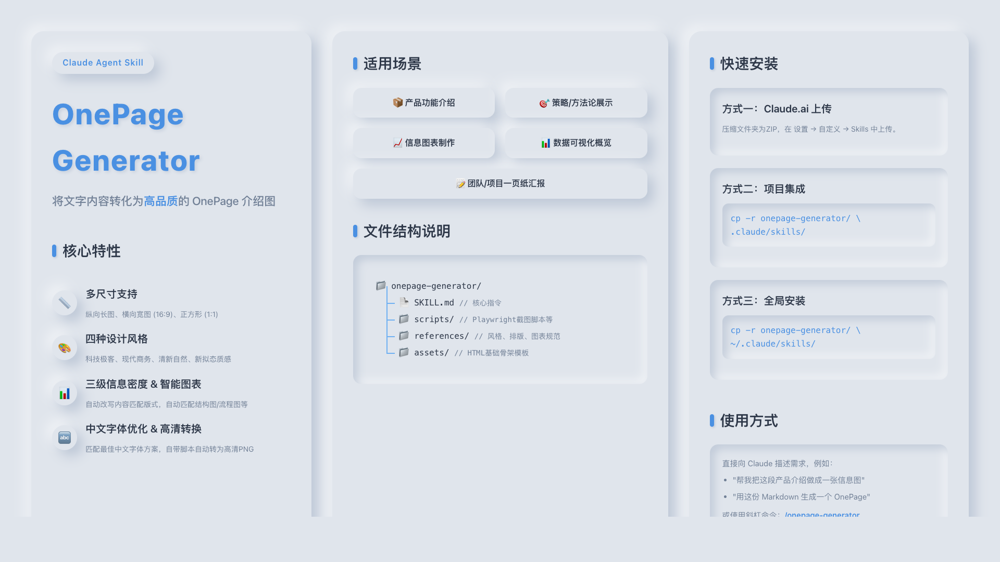

<div align="center">
  <a href="#english">English</a> | <a href="#简体中文">简体中文</a>
</div>

---

<h1 id="english">Onepager</h1>

> A Claude Agent Skill for converting text content into high-quality OnePage infographics.



## Overview

Onepager is a Claude Agent Skill that transforms your provided text, Markdown, or PDF content into beautiful OnePage infographics (single-page visual posters) through a progressive interactive workflow.

### Use Cases

- Product feature introductions
- Strategy / methodology presentations
- Infographic creation
- Data visualization overviews
- One-page team/project reports

### Core Features

- **Multiple Sizes**: Vertical scroll (Mobile), Horizontal widescreen (16:9), Square (1:1), Portrait poster (3:4 for Xiaohongshu/WeChat)
- **Eight Design Styles**: Dark Editorial, Swiss Precision, Organic Nature, Constructivist Brutalism, Neo-Pop Editorial, Minimalist East, Data Journalism, Cyber Street
- **Three Information Densities**: Low/Medium/High density, automatically rewriting content to match the layout
- **Content Intelligence**: Applies consulting-grade content principles (MECE, Pyramid, SCQA, So What, Quantification) to restructure content for maximum impact
- **Type Differentiation**: Automatically detects and adapts to 5 content types (Product Intro, Product Manual, Solution Pitch, Operation Guide, Infographic) with type-specific restructuring
- **Smart Diagram Matching**: Automatically selects flowcharts, structure diagrams, architecture diagrams, etc., based on content logic
- **Optional BigNumber**: Toggle data highlight modules on/off (E1/E2), replace with quotes, diagrams, or whitespace when disabled
- **Signature/署名**: Auto-detect from git user name or customize with brand name; per-style CSS styling for 8 design styles
- **Content-Based Naming**: Output files named as `{topic}-{size}-{style}-{date}` instead of generic names, avoiding overwrites
- **One-Click Config**: Accept recommended settings in one step during the interactive configuration phase
- **Visual Standards**: 8pt Grid system, 60-30-10 color rule, WCAG AA contrast, consistent icon styles
- **Enhanced Layout Engine**: Automatically handles complex layouts, Flex/Grid adaptations, and alignment optimization
- **Chinese Typography Optimization**: Matches the best Chinese font scheme based on the design style
- **Automated Quality Checks**: Built-in quality check script validates design compliance (color, typography, layout) before screenshot, supports `--no-bignum` mode
- **HTML → PNG Conversion**: Built-in Playwright screenshot script to automatically convert to high-resolution images
- **Iteration & Rework**: Built-in guidance for fine-tuning, config changes, and content revisions post-delivery

## Installation

### Method 1: Upload on Claude.ai

1. Compress the `onepager/` folder into a ZIP file.
2. Open Claude.ai → Settings → Customization → Skills.
3. Click "+" → Upload the ZIP file.

### Method 2: Project Integration (Claude Code / Trae)

Copy the folder to your project's `.claude/skills/` or `.trae/skills/` directory:

```bash
cp -r onepager/ .trae/skills/onepager/
```

### Method 3: Global Installation

```bash
cp -r onepager/ ~/.trae/skills/onepager/
```

## Usage

Simply describe your request to the AI to trigger it automatically, for example:

- "Help me make an infographic out of this product description"
- "Generate a OnePage from this Markdown"
- "Turn this text into a long image suitable for mobile reading"

Or use the slash command to call it explicitly: `/onepager`

## File Structure

```text
onepager/
├── SKILL.md                  # Core instructions (Entry point for the Agent)
├── scripts/
│   ├── capture.py            # Playwright HTML→PNG screenshot script
│   ├── install_deps.sh       # Dependency installation helper script
│   └── quality_check.py      # Automated design quality validation script
├── references/
│   ├── design-styles.md      # Full visual specifications for the 8 design styles
│   ├── typography.md         # Chinese font schemes and typography parameters
│   ├── layout-specs.md       # Layout specifications for the 3 sizes
│   ├── diagram-guide.md      # Diagram type matching and drawing guide
│   ├── density-guide.md      # Information density and content rewriting rules
│   ├── type-differentiation.md # Differentiated guidelines for 5 content types
│   └── visual-standards.md   # Cross-style universal visual standards
├── assets/
│   └── templates/
│       └── base-skeleton.html# HTML base skeleton template
├── LICENSE.txt
└── README.md
```

## Dependencies

The screenshot feature requires the following dependencies (Optional, Agent will install them automatically when needed):

- Python 3.8+
- Playwright (`pip install playwright`)
- Chromium (`python -m playwright install chromium`)

If the runtime environment does not support screenshot tools, the Skill will directly deliver the HTML file.

## License

Apache License 2.0

---

<h1 id="简体中文">Onepager</h1>

> 将文字内容转化为高品质 OnePage 介绍图的 Agent Skill。


## 功能概述

Onepager 是一个 Agent Skill，能够将用户提供的文字、Markdown 或 PDF 内容，通过渐进式交互流程，转化为精美的 OnePage 信息图（单页可视化海报）。

### 适用场景

- 产品功能介绍
- 策略/方法论展示
- 信息图表制作
- 数据可视化概览
- 团队/项目一页纸汇报

### 核心特性

- **多尺寸支持**：纵向长图、横向宽图 (16:9)、正方形 (1:1)、竖版海报 (3:4，适合小红书/公众号封面)
- **八种设计风格**：暗夜编辑、瑞士精密、有机自然、建筑粗野、新波普编辑、极简东方、数据新闻、赛博街道
- **三级信息密度**：低/中/高密度，自动改写内容匹配版式
- **内容智能**：运用咨询级内容原则（MECE、金字塔原理、SCQA、So What、量化优先）重构内容，最大化传达效果
- **类型差异化**：自动识别并适配 5 种内容类型（产品介绍、产品说明、方案介绍、操作指南、信息图），按类型定制重构策略
- **智能图表匹配**：根据内容逻辑自动选择流程图、结构图、架构图等
- **BigNumber 可选**：数据展示模块可开关（E1/E2），关闭时可用引言块、图表或留白替代
- **署名支持**：自动从 git 用户名读取，或自定义品牌名/公众号名；8 种风格各有专属署名样式
- **内容命名**：输出文件按 `{主题}-{尺寸}-{风格}-{日期}` 命名，避免覆盖已有文件
- **一键采纳推荐**：配置阶段可直接回车采纳推荐配置，快速开始
- **视觉规范**：8pt Grid 对齐系统、60-30-10 色彩法则、WCAG AA 对比度、统一图标风格
- **排版引擎强化**：自动处理复杂布局、Flex/Grid 适配、对齐优化
- **中文字体优化**：根据设计风格匹配最佳中文字体方案
- **自动化质量检查**：内置质量检查脚本，在截图前自动校验设计合规性（配色、排版、布局），支持 `--no-bignum` 模式
- **HTML → PNG 转换**：自带 Playwright 截图脚本，自动转为高清图片
- **调整迭代**：交付后支持微调、配置变更、内容修改等迭代流程

## 安装方式

### 方式一：Claude.ai 上传

1. 将 `onepager/` 文件夹压缩为 ZIP 文件
2. 打开 Claude.ai → 设置 → 自定义 → Skills
3. 点击 "+" → 上传 ZIP 文件

### 方式二：项目集成 (Claude Code / Trae)

将文件夹复制到项目的 `.claude/skills/` 或 `.trae/skills/` 目录下：

```bash
cp -r onepager/ .trae/skills/onepager/
```

### 方式三：个人全局安装

```bash
cp -r onepager/ ~/.trae/skills/onepager/
```

## 使用方式

直接向 AI 描述你的需求即可自动触发，例如：

- "帮我把这段产品介绍做成一张信息图"
- "用这份 Markdown 生成一个 OnePage"
- "把这段文字做成一张适合手机阅读的长图"

或使用特定的唤醒词/斜杠命令显式调用：`/onepager`

## 文件结构说明

```text
onepager/
├── SKILL.md                  # 核心指令（Agent 读取的入口）
├── scripts/
│   ├── capture.py            # Playwright HTML→PNG 截图脚本
│   ├── install_deps.sh       # 依赖安装辅助脚本
│   └── quality_check.py      # 自动化设计质量校验脚本
├── references/
│   ├── design-styles.md      # 八种设计风格的完整视觉规范
│   ├── typography.md         # 中文字体方案与排版参数
│   ├── layout-specs.md       # 三种尺寸的版式规范
│   ├── diagram-guide.md      # 图表类型匹配与绘制指南
│   ├── density-guide.md      # 信息密度与内容改写规则
│   ├── type-differentiation.md # 五种内容类型的差异化指南
│   └── visual-standards.md   # 跨风格通用视觉规范
├── assets/
│   └── templates/
│       └── base-skeleton.html  # HTML 基础骨架模板
├── LICENSE.txt
└── README.md
```

## 依赖

截图功能需要以下依赖（可选，Agent 会在需要时自动安装）：

- Python 3.8+
- Playwright (`pip install playwright`)
- Chromium (`python -m playwright install chromium`)

如果运行环境不支持截图工具，Skill 会直接交付 HTML 文件。

## 许可证

Apache License 2.0
